# 📰 HR & Talent News Scraper + Gemini Post Generator

[](https://colab.research.google.com)
  

---

### ⚡ Overview

This project automates your **HR and Talent Acquisition content workflow** - from scraping top industry headlines to generating **LinkedIn-ready posts and image prompts** powered by **Google Gemini**.

It’s easily adaptable for any HR, recruitment, or marketing team that wants to stay ahead of trends and publish high-impact content.

---

## 🧠 Workflow Summary

```mermaid
graph TD
A[📰 Scrape HR & Tech Feeds] --> B[🧹 Clean & Store in DataFrame]
B --> C[⭐ Rank by Engagement]
C --> D[💬 Generate LinkedIn Captions]
D --> E[🎨 Create Canva Image Prompts]
E --> F[📊 Export CSV / Weekly Report]
```



---

## 🚀 Features

✅ **Weekly Auto-Scraping** of top HR & tech publications </br>
✅ **AI-Driven Ranking** of most engaging headlines </br>
✅ **LinkedIn Caption Generation** in Cygnify’s tone and brand voice </br>
✅ **Canva AI Prompt Suggestions** for professional visuals </br>
✅ **Structured Output** in Pandas DataFrame → CSV </br>

---

## ⚙️ Installation & Setup

### 1️⃣ Install Dependencies

```bash
!pip install feedparser
!pip install google-generativeai
!pip install pandas
```

### 2️⃣ Import Packages

```python
import feedparser
from datetime import datetime, timedelta
import pandas as pd
import google.generativeai as genai
import json, re, os
```

### 3️⃣ Configure your API key

For Colab users:

```python
from google.colab import userdata
GOOGLE_API_KEY = userdata.get('GOOGLE_API_KEY')
genai.configure(api_key=GOOGLE_API_KEY)
```

For local environments:

```python
import os, google.generativeai as genai
genai.configure(api_key=os.getenv("GOOGLE_API_KEY"))
```


---

## 🗂 Output

| Headline                                                            | Date       | Source   | Link                                            | Category | Caption                    | Image Prompt           |
| ------------------------------------------------------------------- | ---------- | -------- | ----------------------------------------------- | -------- | -------------------------- | ---------------------- |
| Why hiring Gen Z means HR has to rethink the entire talent playbook | 2025-08-20 | HRM Asia | [Link](https://hrmasia.com/why-hiring-gen-z...) | Trend    | Generated LinkedIn caption | Generated Canva prompt |

The DataFrame can be exported:

```python
scraped_articles_df.to_csv("weekly_hr_news.csv", index=False)
```

---

## 🧭 Future Enhancements

* 🧮 Add automatic sentiment and category tagging (Trend, Policy, Tech, Scandal, etc.)
* 🤖 Automate weekly runs via Colab scheduler or GitHub Actions
* 📊 Visualize top-performing HR content over time


